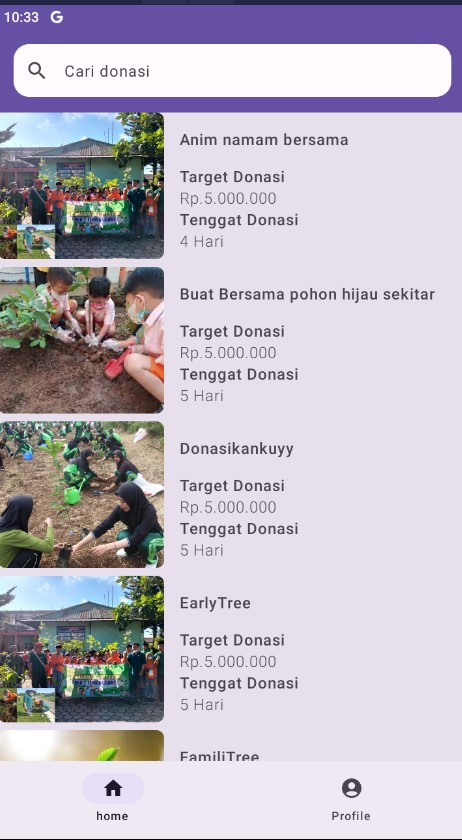
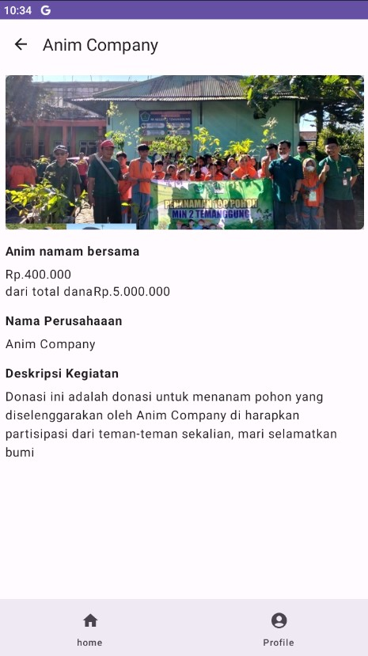
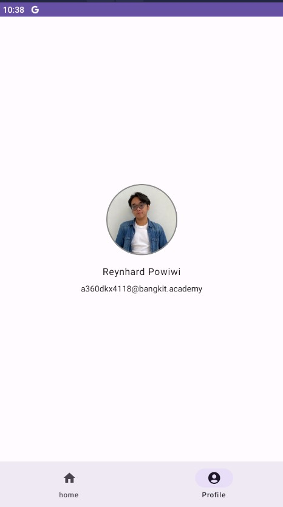

# Submission_Dicoding-Android_Jetpack_Compose
oleh Reynhard Powiwi

# DonasiKu 🤲💙

DonasiKu adalah aplikasi yang memungkinkan pengguna untuk menampilkan dan mengelola donasi atau galang dana. Aplikasi ini dirancang untuk membantu pengguna dalam menggalang dana untuk berbagai tujuan, mulai dari amal, bencana alam, hingga proyek pribadi.

   

## Fitur ✨

- **Tampilan Donasi:** Pengguna dapat melihat daftar donasi yang ada, termasuk informasi tentang tujuan donasi dan jumlah yang terkumpul
- **Pencarian Donasi:** Pengguna dapat mencari donasi berdasarkan kata kunci nama donasi
- **Profil Pengguna:** Setiap pengguna memiliki profil yang menampilkan informasi tentang donasi yang mereka galang, jumlah donasi yang terkumpul, dan informasi pengguna lainnya.

Selamat mencoba 😉✨
